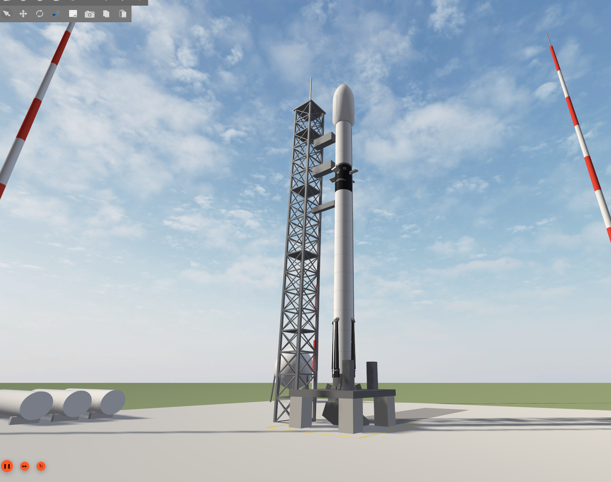
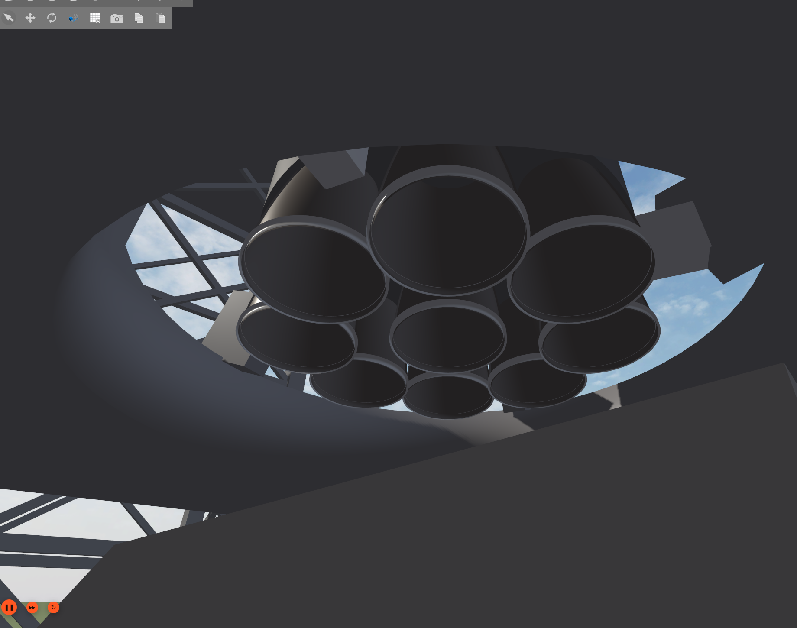
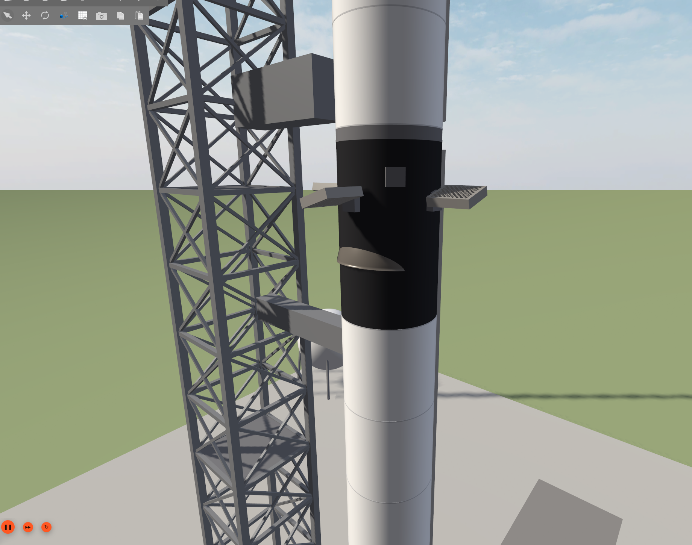
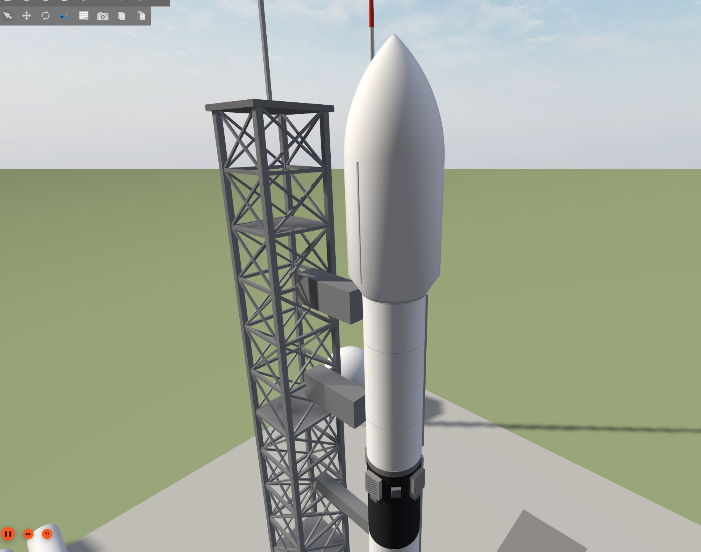

# spacex_rocket_description — Falcon 9 Block 5 for ROS 2 Jazzy / Gazebo Harmonic

A data-driven Falcon 9 Block 5 model for ROS 2 Jazzy, Gazebo Harmonic and RViz 2. You edit one YAML file, and a script regenerates the
URDF, the mass properties and the Blender-built glTF meshes from it.



| | |
|---|---|
|  |  |
| Octaweb: 9 Merlin 1D engines, each on its own 2-axis gimbal | Interstage: 4 grid fins (deploy and steer joints) |
|  | |
| 5.2 m fairing: two halves, separate URDFs | |

## What's in the model

The model has three parts, split where the real vehicle separates. Each part is its own URDF.

| Part | File | Contents |
|---|---|---|
| Booster (S1) | `urdf/falcon9.urdf` | 9 Merlin 1D on 2-axis gimbals, 4 grid fins (deploy and steer), 4 landing legs, interstage |
| Upper stage (S2) | `urdf/falcon9_upper.urdf` | Merlin Vacuum on a 2-axis gimbal, payload adapter and payload |
| Fairing | `urdf/falcon9_fairing_a.urdf`, `urdf/falcon9_fairing_b.urdf` | One file per fairing half |

`urdf/falcon9_assembly.yaml` gives the stacking offsets for the three parts.

**Single source of truth: `vehicles/falcon9.yaml`.**
- **Published figures:** stage dry and propellant masses, Merlin thrust and Isp, fairing size, overall height. Each value is tagged in the file with its source.
- **Engineering estimates:** everything else, chosen to stay consistent with the published totals. These are labelled as such.
- **Generated from the YAML by `tools/vehicle_model.py`:** link masses and inertia tensors, built from the tank geometry and propellant densities rather than typed by hand.
- **Propellant tables:** mass, CoM and inertia as functions of the propellant remaining are written to `vehicles/*_massprops.csv`.

**Checks** (`python3 -m pytest tools/tests`):
- every inertia tensor is physically valid (positive definite, triangle inequality);
- the link masses add up to the stage budgets.

Compared with the published figures, the model's height matches and its gross mass is within about 3%.

> Not affiliated with or endorsed by SpaceX. Values are approximations built from public
> sources plus engineering estimates. This is a simulation and learning model, not SpaceX data.

## Quick start

```bash
cd ~/ros2_ws/src && git clone https://github.com/soumics/spacex_rocket_description.git
cd ~/ros2_ws && colcon build --packages-select spacex_rocket_description && source install/setup.bash

# RViz, with joint sliders for the gimbals, grid fins and legs
ros2 launch spacex_rocket_description display.launch.py vehicle:=falcon9

# Gazebo Harmonic
gz sim -r empty.sdf &
ros2 run ros_gz_sim create -world empty -file $(ros2 pkg prefix spacex_rocket_description)/share/spacex_rocket_description/urdf/falcon9.urdf -name falcon9 -z 1.5
```

The URDFs also declare Gazebo systems for propulsion, aerodynamics and avionics (`RocketPropulsion`,
`RocketAero`, `VehicleSensors`, `ActuatorServos`). Those plugins belong to a separate research project and
are **not** in this repository. Without them Gazebo logs "Failed to load system plugin" and loads the
vehicle as a passive rigid-body model. The RViz view is unaffected.

## Regenerating the vehicle

```bash
python3 tools/gen_urdf.py vehicles/falcon9.yaml          # URDFs + mass-property tables
blender --background --factory-startup --python tools/blender/build_vehicle_meshes.py -- \
        vehicles/falcon9.yaml meshes/falcon9              # glTF meshes (Blender 4.x, bpy)
python3 tools/textures/make_effect_textures.py materials/textures   # exhaust/smoke sprites
```

Meshes are glTF 2.0 (`.glb`), exported Z-up in each link's frame. Collision geometry uses simple primitives.

## Layout

```
vehicles/   falcon9.yaml (the definition) + generated mass-property tables
urdf/       generated URDFs (do not edit by hand)
meshes/     Blender-generated glTF meshes
materials/  particle textures for exhaust effects
launch/     display.launch.py (RViz)
tools/      URDF/mass-property generator, Blender mesh builder, texture generator, tests
```

## License

Apache-2.0
